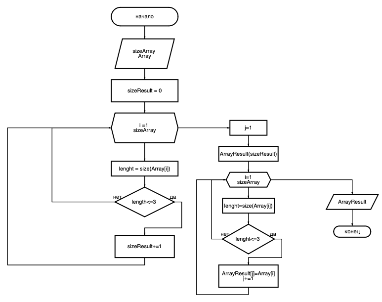

# Итоговая контрольная работа по основному блоку.
В этом реппозитории находится решение итоговой контрольной работы по основному блоку.

Основные блоки алгоритма:
1. Получить исходный массив 
2. вычислить размер итогового массива 
3. Заполнить итоговый массив элементами меньше или равно 3-м.
4. Вывести итоговый массив.

Ниже приведено изображение блок-схемы

